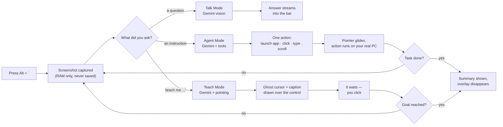

<div align="center">


[](https://git.io/typing-svg)

**An open-source, screen-aware AI assistant for Windows.**
Self-hosted. Privacy-first. Zero telemetry. Your API key, your data.

[](LICENSE)


[](https://github.com/nikeshsundar/argus/stargazers)

</div>

---

> **Status: Actively developed.** Talk, Agent and Teach Mode are all working. See the [roadmap](#roadmap) for what is next.

### Contents

[Download](#download-no-build-required) · [Demo](#demo) · [Features](#features) · [Saved Workflows](#️-saved-workflows) · [Teach Mode](#-teach-mode) · [How it works](#how-it-works) · [Why Argus?](#why-argus) · [Privacy](#privacy) · [Getting Started](#getting-started) · [Commands](#commands--keyboard-shortcuts) · [Chat History](#chat-history--persistence) · [The Hotkey](#how-the-hotkey-works) · [Roadmap](#roadmap) · [Development](#development) · [Safety](#safety--agent-mode) · [Contributing](#contributing)

**[→ nikeshsundar.github.io/argus](https://nikeshsundar.github.io/argus)** — what it does, and how to install it, in five minutes.

## Demo

> [!TIP]
> **A GIF belongs right here.** Record <kbd>Alt</kbd>+<kbd>`</kbd> → ask a question → get an answer, and separately an Agent Mode task, with [ScreenToGif](https://www.screentogif.com/) or [ShareX](https://getsharex.com/) — both free, both built for exactly this. Save it as `docs/demo.gif` and drop this in above:
>
> ```markdown
> 
> ```

## Features

### 🎯 Talk Mode
Ask questions about what's on your screen with full conversation history.
- Follow-up context preserved across messages
- See Gemini analyze your screen in real-time
- Chat history is persistent and resumable

### 🤖 Agent Mode
Hand over the wheel and it does the task itself.
- Clicks, types and navigates on your real desktop
- **The pointer travels** — an eased glide with a halo and a click ring, so you can follow every move instead of watching things happen
- No trigger word needed: *"open instagram"* is understood as an instruction
- Safety limits: 14 actions max, <kbd>Esc</kbd> stops it mid-movement, amber frame while it has control

**Examples:**
- *"open notepad and write a grocery list"*
- *"open chrome and go to github.com"*
- *"agent find the cheapest flight tomorrow"* — the `agent` prefix still forces it

### 🎤 Voice
Click the mic and say it, then click again. Long instructions are miserable to type and effortless to speak, which is exactly what Agent Mode asks for.

> *(spoken)* "um, open youtube and uh search for mister beast" → **"Open YouTube and search for MrBeast"**

- Fillers, false starts and misheard brand names are cleaned up as part of transcribing — you get what you meant, not a literal transcript
- **Click to record, click to stop.** Never a wake word — nothing listens in the background. The bar turns red and the mic pulses while it's live, <kbd>Esc</kbd> discards a recording, and one stops itself after 60 seconds so a forgotten mic can't stay open
- Talk Mode sends straight away. Agent and Teach put the text in the box and wait for <kbd>Enter</kbd> — speech misheard by one word shouldn't move your mouse
- Argus never speaks back. Dictation, not a conversation

### ♻️ Saved Workflows
Agent Mode costs a model call per step and most of a minute per task, against a free tier of **20 calls a day**. But the second time you ask for the same thing, the answer is already known.

So when a run succeeds, keep it:

```
agent open chrome and go to github.com/new
  → done. Save it with "/save <name>" and it replays instantly next time.

/save new repo
  → Saved "new repo" — 4 steps, about 6s to replay with no model calls.
```

Then just type **`new repo`** in Agent Mode. Same pointer, same overlay, same <kbd>Esc</kbd> — and **zero API calls**, in seconds instead of a minute.

- **Records the agent's actions, not yours.** Watching you would mean a global keyboard hook running all day — a keylogger, in an app whose whole promise is that it isn't watching. The agent's own action list is already structured, already semantic, and already known to have worked
- Only successful actions are kept. A replay has no model to recover with, so a step that failed the first time is never repeated
- A replay **stops at the first failure** rather than typing the rest of the sequence into whatever is now on screen
- **Refuses to run on a differently shaped screen.** Coordinates are normalised, so 1080p → 4K is fine; 16:9 → ultrawide moves every control relative to the grid, and a blind click would land on whatever now occupies that spot
- `/workflows <name>` shows the exact steps before you run anything

### 🎓 Teach Mode
The one that doesn't exist anywhere else. Ask to be *taught* and it refuses to do it for you.

A **blue ghost cursor** appears over the real control, captioned with what the step does and why — then it waits. You click. It looks at the new screen and points at the next thing.

> *"teach me how to create a new repo in github"*

- **Never touches your mouse.** The overlay is click-through; your click reaches the real UI and Argus only watches
- **Knows when you clicked the wrong thing** — your click is reported with its distance from the target, so it re-points instead of pressing on
- <kbd>Space</kbd> advances any step, so a missed target can't trap you; <kbd>Esc</kbd> quits
- In Talk Mode the same phrase gives numbered written steps instead

No more pausing a YouTube tutorial every four seconds to switch tabs.

### 🔒 Privacy Built-In
- Screenshots stay in RAM only—never written to disk or logged
- Disabled when the hotkey isn't pressed
- Your own API key—no Argus servers, no data collection
- BYOK (Bring Your Own Key) model

## What it does

Hit <kbd>Alt</kbd>+<kbd>`</kbd> from anywhere in Windows. Argus grabs your screen and opens a small bar, and you either ask it something or hand it the wheel.

**Talk Mode** — ask about what you're looking at, then keep asking.

> *"who is this creator?"* → *"how many subscribers?"* → *"what's their most popular video?"*

Follow-ups understand what came before, so you don't have to re-explain yourself.

**Agent Mode** — say what you want done and it operates the computer itself.

> *"open notepad and type hello"* · *"open chrome and go to github"*

It looks at the screen, decides the next click or keystroke, does it, looks again, and repeats until the task is done. The pointer glides visibly to each target, so you can see what it is about to do while it is still doing it.

**Teach Mode** — say *"teach me…"* and it does the opposite: it points, and you do it.

> *"teach me how to create a new repo in github"*

A blue ghost cursor lands on the button you need, with a caption explaining what it does. Then it waits for you. Agent Mode leaves you no wiser; this one means you can do it again tomorrow without Argus.

## How it works



Every Agent Mode step re-captures the screen before deciding the next move — it never fires off a blind sequence of actions. Teach Mode does the same, except the thing it waits for is you.

## Why Argus?

**Open source & self-hosted.** Proprietary screen-aware assistants exist, but they're closed-source, Mac-only, or cost $20–100/month. Argus is free, for Windows, and you have the source.

**Privacy first.** Your screen contents are deeply personal data. The software that reads them should be something you can inspect, audit, and self-host. No cloud. No logging. No telemetry.

**Bring your own model.** Use Gemini or add your own provider. Your API key stays on your machine—no Argus intermediaries.

## Privacy

- Screenshots are **held in memory only** — never written to disk, never logged, and dropped when you dismiss the bar. Saved chats keep their text, never the image.
- The screen is captured **only when you press the hotkey**. Nothing runs in the background watching you.
- You bring your own API key. There is no Argus server; your screen goes to the model provider *you* choose, and nowhere else.

## Requirements

- Windows 10/11
- A free [Google Gemini API key](https://ai.google.dev)

## Getting Started

### Download (no build required)

**[⬇ Download the latest installer](https://github.com/nikeshsundar/argus/releases/latest)** — run it, and Argus lives in your system tray.

On first launch press <kbd>Alt</kbd>+<kbd>`</kbd> and set a free [Gemini API key](https://aistudio.google.com/apikey):

```
/key YOUR_KEY_HERE
```

> [!NOTE]
> Windows will show **"Windows protected your PC"**. The installer isn't code-signed — a certificate costs a few hundred dollars a year, which a free project doesn't have. Click **More info → Run anyway**. Every release is built by [GitHub Actions](.github/workflows/release.yml) from the tag it's named after, so you can check the source the binary came from.

### Build it yourself

Prefer to compile it, or want to change something? Everything below builds the same installer.

### Prerequisites
- Windows 10 or 11
- An API key from Google Gemini
  - [Get a Gemini API key](https://ai.google.dev)

### Quick Start

```bash
git clone https://github.com/nikeshsundar/argus.git
cd argus
npm install
npm run dev
```

The app lives in your system tray. Press <kbd>Alt</kbd>+<kbd>`</kbd> to open the bar.

**First time setup:**
1. Paste your Gemini API key into the bar: `/key YOUR_API_KEY`
2. Argus activates and selects the matching model
3. Start asking

**Note:** `npm run dev` also prints a local Vite URL. Ignore it—it won't work in a browser since Argus needs desktop APIs.

### Build a Windows Installer

```bash
npm run package   # outputs release/Argus-<version>-Setup.exe
```

## Commands & Keyboard Shortcuts

### Opening the Bar
| Shortcut | Action |
| --- | --- |
| <kbd>Alt</kbd>+<kbd>`</kbd> | Open / close the bar (default, rebindable) |

### In the Bar
The bar is just an input. Nothing floats over your screen until you ask it to.

| Key | Action |
| --- | --- |
| <kbd>/</kbd> | Open the command palette |
| <kbd>↑</kbd> / <kbd>↓</kbd> | Navigate the palette |
| <kbd>Enter</kbd> | Send, or run the highlighted command |
| <kbd>Esc</kbd> | Close the bar |
| *click the chip* | Switch between **Talk** and **Agent** |

The chip on the left shows what pressing <kbd>Enter</kbd> will do, and updates as you type — it turns blue and reads **Teach** the moment it sees *"teach me…"*.

### While Agent or Teach Mode is running
| Key | Action |
| --- | --- |
| <kbd>Esc</kbd> | Stop immediately — interrupts a pointer glide mid-movement |
| <kbd>Space</kbd> | *(Teach Mode)* mark the step done and move on |

### Commands
Type these into the bar to configure or control Argus:

| Command | Description |
| --- | --- |
| `/key <api-key>` | Add a Gemini API key (keys stack; they don't replace each other) |
| `/keys` | List the keys in rotation, and whether each is ready or resting |
| `/keys <k1> <k2> …` | Load several keys at once, in the order given |
| `/keys reset` | Clear cooldowns and try every key again |
| `/keys clear` | Remove every stored key |
| `/model <model-id>` | Change the Talk Mode model |
| `/model agent <id>` | Change the Agent + Teach model (a fast one; see below) |
| `/hotkey <combo>` | Rebind the activation hotkey (e.g., `Control+Alt+Space`) |
| `/cursor <pace>` | Pointer speed: `natural` (default), `demo` (slow, for recording), `instant` |
| `/save <name>` | Keep the last successful Agent run as a replayable workflow |
| `/workflows` | List saved workflows, with step counts and how often each is used |
| `/workflows <name>` | Show a workflow's exact steps before running it |
| `/workflows delete <name>` | Remove one |
| `/workflows clear` | Remove them all |
| `/run <name>` | Replay a workflow — no model call. Typing the bare name in Agent Mode does the same |
| `/history` | Browse and resume past conversations |
| `/new` | Start a fresh chat |
| `/forget` | Delete all saved chats permanently |
| `/help` | List all commands |

### Two models, on purpose

Talk Mode asks one question and the answer is the product, so it runs a stronger model. Agent and Teach fire a dozen quick *"which control next"* calls per task, where a slow model is felt a dozen times over.

Measured against the live API on one agent turn:

| Model | Time per turn | Targeting accuracy |
| --- | --- | --- |
| `gemini-3.6-flash` | ~11,000 ms | — |
| `gemini-3.5-flash-lite` *(default for Agent/Teach)* | ~1,500 ms | within 2px |

That is the difference between a three-minute task and a twenty-second one, with no measurable loss in where it clicks.

### Several keys, with failover

`/key` adds rather than replaces. When a key is refused for quota, Argus rests it and the next one picks up the same request — so a limit reached halfway through an agent task doesn't end the task, which is the part that actually hurts.

A newly added key goes to the **front** of the queue — you add one because the last ran out, so trying the spent one first would waste a request every time before reaching it. Cooldowns are also remembered across restarts, since a daily cap outlives the session that discovered it.

A key refused for a *daily* cap is rested for 15 minutes rather than the ~20 seconds the server suggests: that hint is the per-minute window talking, and honouring it would spend the key again immediately. A key rejected outright (`401`) is set aside for the session — no amount of waiting fixes a wrong credential — and `/keys` shows it as *rejected* so you know which to replace.

`/keys` shows the pool and what's ready.

> [!NOTE]
> Extra keys only add headroom if they come from **different Google Cloud projects**. Quota is per project, so a second key in the same project shares the same exhausted allowance — verified the hard way. If you want real headroom, enabling billing removes the daily cap entirely, and `gemini-3.5-flash-lite` costs cents.

Argus also tries to spend fewer requests per task. Putting text in a box — an address bar, a search field, a form — used to be three round trips (click, type, press Enter) and is now one, since on a 20-a-day budget the number of steps matters more than the speed of each.

> [!IMPORTANT]
> **Free-tier quota is per model, per project, per day** — and it is small. `gemini-3.6-flash` allows **20 requests/day**, which one agent task can exhaust on its own. Since the limit is per *model*, Agent and Teach drawing on a different one gives them their own allowance. A second API key in the same Google Cloud project shares the same quota, so making a new key does not reset it.

## Chat History & Persistence

Every conversation is saved automatically, so you can resume later without losing context.

- Pick up conversations with `/history` or the "Past chats" option
- Chat text is preserved; screenshots are not (only held in RAM)
- Switching to a new screen mid-conversation? No problem—the AI sees your current screen while remembering what you discussed
- All chats stored locally in `%APPDATA%\argus\history.json`
- Use `/forget` to delete all history at once

This design lets you build on conversations across sessions while maintaining privacy.

## How the Hotkey Works

By default, Argus binds <kbd>Alt</kbd>+<kbd>`</kbd>. 

Why not <kbd>Win</kbd>+<kbd>key</kbd>? Windows restricts Win-combinations at the OS level and doesn't hand them to apps. Argus uses a low-level keyboard hook (same as PowerToys) to capture keys when Electron can't claim them natively.

A hook can *see* a keystroke but cannot *block* it from reaching other apps. That's why <kbd>Win</kbd>+<kbd>`</kbd> isn't the default: it would open Windows Terminal's quake mode every time. <kbd>Alt</kbd>+<kbd>`</kbd> is free on stock Windows.

**Conflicting hotkey?** Rebind with `/hotkey Control+Alt+Space` or any combo you prefer.

## Roadmap

### ✅ Completed
- [x] Global hotkey (including Win combinations), system tray, request bar
- [x] In-memory screen capture with zero-disk storage
- [x] Talk Mode with follow-up context (Gemini)
- [x] Command palette in the bar
- [x] Persistent chat history (resumable conversations)
- [x] Agent Mode with autonomous mouse & keyboard (Gemini)
- [x] Visible pointer travel — eased glide, halo, click ring, three speeds
- [x] Intent routing — instructions reach the agent without a trigger word
- [x] Teach Mode — ghost cursor, captioned steps, waits for the learner
- [x] Voice input — click to record, filler-cleaned transcription
- [x] Saved workflows — replay a successful Agent run with no model call

### 🚧 In Progress & Planned
- [ ] Local transcription (Whisper) — voice off the daily quota entirely
- [ ] Plan preview & undo for Agent Mode
- [ ] Support for additional providers
- [ ] On-screen annotations (arrows, highlights, boxes)
- [ ] Replayable lessons — save a Teach Mode walkthrough and share it
- [ ] OpenAI and local Ollama provider support
- [ ] Settings UI (currently all in-bar commands)
- [ ] Encrypt stored API keys with Electron `safeStorage`
- [ ] Prebuilt installers in GitHub Releases
- [ ] Multi-monitor support optimization

Contributions welcome! See [Contributing](#contributing) for details.

## Development

### Setup
```bash
npm run dev        # run with hot reload
npm run typecheck  # type-check main, preload, and renderer
npm test           # run unit tests
npm run build      # bundle to out/
npm run icon       # regenerate resources/icon.png
```

### Project Structure
```
src/main/       Electron main process — hotkey, screen capture, agent loop,
                teach loop, pointer glide, windows, system tray
src/preload/    Context-isolated bridge exposed to the renderer
src/renderer/   UI: request bar, agent overlay, ghost cursor
src/shared/     Shared logic used across processes — intent routing, teach
                parsing, pointer easing (all unit tested)
tests/          Unit tests for core logic and integration
```

### Key Technologies
- **Electron** — Cross-platform desktop framework
- **Vite** — Lightning-fast build tooling  
- **TypeScript** — Type-safe codebase
- **Google Gemini** — vision and tool-calling behind all three modes
- **nut.js / uiohook** — pointer control, and watching the learner's clicks without intercepting them

## Safety & Agent Mode

Agent Mode gives an AI real control of your mouse and keyboard. Here's how we keep that safe:

| Safety Layer | How It Works |
| --- | --- |
| **Visual Indicator** | Pulsing amber frame covers the screen during agent execution — it never operates silently |
| **Instant Kill** | Press <kbd>Esc</kbd> from anywhere to stop immediately, even if Argus isn't focused |
| **Action Cap** | Maximum 14 actions per task—prevents infinite loops or runaway behavior |
| **Single-Step Execution** | One action at a time with screen re-capture between steps; nothing is decided in advance |
| **Visible Travel** | The pointer glides to its target rather than teleporting, so you can see where a click is going before it lands |

**Warning:** Agent Mode controls your real mouse and keyboard. Only direct it at tasks you can afford to have clicked/typed. Always supervise autonomous mode on unfamiliar websites or critical applications.

### Replaying a workflow is blind — deliberately

A live agent looks at the screen before every action. A replay does not: skipping the screenshot and the model call is precisely what makes it free and quick. It clicks the coordinates that worked last time.

So it gets the same overlay, the same <kbd>Esc</kbd>, and three limits a live run doesn't need:

- **Stops at the first failure**, instead of typing the remaining steps into whatever is now on screen
- **Refuses a differently shaped screen**, where fixed coordinates would land somewhere else entirely
- **`/workflows <name>` prints every step** before you commit to running any of them

Replay what you'd be happy to watch happen. It is a shortcut for a task you have already seen succeed — not a scheduler, and not something to point at a screen you haven't looked at.

### Teach Mode is different

Teach Mode never touches your mouse or keyboard. The ghost cursor is a drawing on a click-through overlay; every real click is yours. If you are wary of handing over control, this is the mode to start with — the worst it can do is point at the wrong button.

## Contributing

Contributions are welcome! Areas that could use help:

- **New providers:** Extend `src/main/providers/` to support OpenAI, Ollama, or other models
- **Annotation UI:** Implement on-screen arrows, highlights, and bounding boxes
- **Settings UI:** Build a dedicated settings window instead of bar-only commands
- **Agent improvements:** Better task decomposition, improved reliability, multi-window support
- **Tests:** Expand test coverage for agent logic and edge cases
- **Documentation:** Improve getting started guides, API docs, architecture docs

### Getting Started with Development
1. Fork the repo and clone locally
2. Run `npm install && npm run dev`
3. Make your changes
4. Run `npm test` to verify tests pass
5. Submit a PR with a clear description of your changes

All PRs should maintain TypeScript strict mode and pass the existing test suite.

## License

[MIT](LICENSE) — Feel free to use, modify, and distribute. See [LICENSE](LICENSE) for details.

---

<div align="center">

**Made with ❤️ by [nikeshsundar](https://github.com/nikeshsundar)**

[⭐ Star this repo](https://github.com/nikeshsundar/argus/stargazers) if Argus is useful to you — it genuinely helps.


</div>
