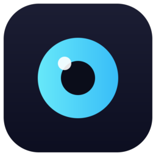
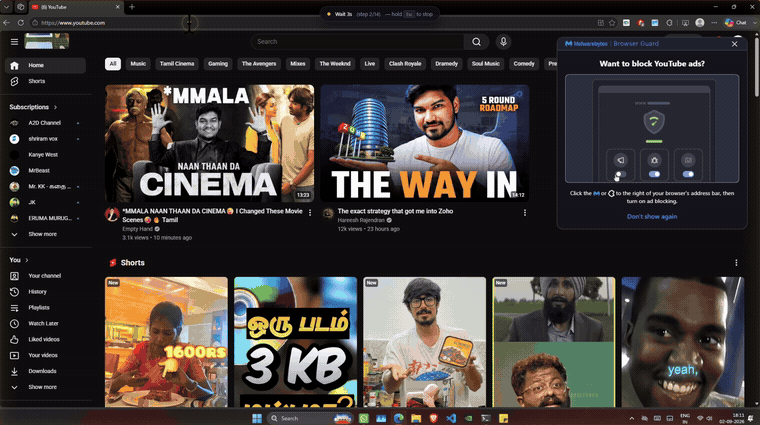
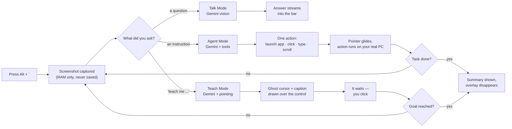

<div align="center">




[](https://git.io/typing-svg)

**An open-source, screen-aware AI assistant for Windows.**
Self-hosted. Privacy-first. Zero telemetry. Your API key, your data.

[](LICENSE)


[](https://github.com/nikeshsundar/argus/stargazers)

</div>

---

> **Status: Actively developed.** Talk, Agent and Teach Mode are all working. See the [roadmap](#roadmap) for what is next.

### Contents

[Install](#install-it) · [Demo](#demo) · [Features](#features) · [Models](#-bring-your-own-model) · [Screen Memory](#-screen-memory) · [Saved Workflows](#-saved-workflows) · [Teach Mode](#-teach-mode) · [How it works](#how-it-works) · [Why Argus?](#why-argus) · [Privacy](#privacy) · [Getting Started](#getting-started) · [Commands](#commands--keyboard-shortcuts) · [Chat History](#chat-history--persistence) · [The Hotkey](#how-the-hotkey-works) · [Roadmap](#roadmap) · [Development](#development) · [Safety](#safety--agent-mode) · [Contributing](#contributing)

**[→ nikeshsundar.github.io/argus](https://nikeshsundar.github.io/argus)** — what it does, and how to install it, in five minutes.

## Demo



*Agent Mode: one sentence, and it opens the browser, searches YouTube and plays the video. The amber bar across the top is Argus reporting each action before it takes it — `Type "mrbeast" at 475,100 · step 3/14 · hold Esc to stop`.*

> [!TIP]
> **The full 65-second walkthrough plays inline** once you upload it. `docs/demo.mp4` is built and ready — drag it into the comment box of any GitHub issue (you never have to post the issue), copy the `https://github.com/user-attachments/assets/…` URL it turns into, and paste that URL on a line of its own here. GitHub renders it as a real player. 10 MB is the free-plan ceiling; the file is 4.6 MB.
>
> Don't link an MP4 through `raw.githubusercontent.com`: it is served with a content type that makes browsers download the file rather than play it, and it puts a binary in your git history for good.

<details>
<summary>Recording your own</summary>

```powershell
winget install Gyan.FFmpeg          # once, if you don't have it
.\scripts\record-demo.ps1 -Seconds 10
```

Five seconds of countdown, then it writes `docs/demo.gif` and `docs/demo.mp4` (H.264 / yuv420p, the combination GitHub's own docs ask for). `-Region 240,140,1440,810` crops to where the action is, which beats shrinking the whole desktop until the text is mush.

Already have a recording? Cut the GIF straight out of it — the source file is never modified:

```powershell
ffmpeg -ss 41 -t 11 -i your-recording.mp4 `
  -vf "fps=10,scale=760:-1:flags=lanczos,split[a][b];[a]palettegen=max_colors=128:stats_mode=diff[p];[b][p]paletteuse=dither=bayer:bayer_scale=3" `
  -loop 0 docs/demo.gif
```

Two rules worth knowing. A GIF holds 256 colours, so a decorative gradient border costs you palette entries that should be spent on UI text — crop it off. And keep the GIF under ~5 MB: it autoplays, so every visitor downloads all of it before they have decided whether they care.

**Shoot Teach Mode next.** It is the thing nothing else does, and it explains itself with no narration: <kbd>Alt</kbd>+<kbd>`</kbd>, *"teach me how to change my display resolution"*, then click each thing the blue ghost cursor points at. Whatever is on your screen ends up in a public file, so close anything you would not post.

</details>

## Features

### 🎯 Talk Mode
Ask questions about what's on your screen with full conversation history.
- **Opens beside your pointer**, not in a fixed spot. You press the hotkey looking at the thing you are asking about, so that is where the answer arrives — it flips to the other side of the cursor near an edge rather than sliding over the control you just asked about. Drag it somewhere and it stays there instead
- Follow-up context preserved across messages
- See Gemini analyze your screen in real-time
- Chat history is persistent and resumable

### 🔑 Bring Your Own Model
`/aimodel` lists what can answer, and you pick.

- **Gemini is the default and it is free** — 20 requests a day, no card, no signup wall. Argus is usable the minute you clone it
- Claude, GPT and local Ollama are one command away: `/aimodel claude sonnet`, `/aimodel 6`, `/aimodel ollama`
- **Paste a key and Argus files it by its own format** — `sk-ant-…`, `sk-…` and `AIza…` each route to the right provider, and Talk Mode switches with them. You never have to say which one it is
- The menu marks which rows are **ready** and which **need a key** before you pick one, rather than letting you find out a request later
- An ambiguous name is refused, not guessed. `/aimodel claude` is fine; `/aimodel flash` matches two models and says so — picking wrong is somebody's money

Agent and Teach Mode still run on Gemini: they are a dozen quick "which control next" calls per task, which is a different job from one answer worth waiting for.

### 🤖 Agent Mode
Hand over the wheel and it does the task itself.
- Clicks, types and navigates on your real desktop
- **The pointer travels** — an eased glide with a halo and a click ring, so you can follow every move instead of watching things happen. Tuned for speed, not for show: `/cursor demo` slows it down for recording, `/cursor instant` removes it
- **Acting is the default.** No trigger word needed: *"open instagram"* is understood as an instruction, and so is anything else that isn't recognisably a question. The chip on the bar names the mode before you press Enter
- **Follow-ups work.** *"open gmail and summarise my unread mail"* → *"open it in Edge instead"* continues the same job, rather than
  opening Edge and calling it done. The last few tasks and how each turned out are carried into the next one, for 15 minutes or until `/new`
- **A question gets an answer, not a travelogue.** If the task was to read, check or find something, what comes back is the thing you asked for — not "I opened Gmail"
- **Take the mouse back whenever you want.** Click, type or scroll and the agent stands down between steps and hands control over; go quiet for three seconds and it picks up where it left off. The frame goes amber -> grey so you always know who is driving
- **It notices when it is going in circles.** Repeating an action that reports success but changes nothing is the one failure a screenshot cannot show it, so repetition is counted and named. Twice gets a blunt correction, three times ends the task honestly instead of burning the remaining steps
- Safety limits: 14 actions max, <kbd>Esc</kbd> stops it mid-movement, amber frame while it has control

**Examples:**
- *"open notepad and write a grocery list"*
- *"open chrome and go to github.com"*
- *"agent find the cheapest flight tomorrow"* — the `agent` prefix still forces it

### 🎤 Voice
Click the mic and say it, then click again. Long instructions are miserable to type and effortless to speak, which is exactly what Agent Mode asks for.

> *(spoken)* "um, open youtube and uh search for mister beast" → **"Open YouTube and search for MrBeast"**

- Fillers, false starts and misheard brand names are cleaned up as part of transcribing — you get what you meant, not a literal transcript
- **Click to record, click to stop.** Never a wake word — nothing listens in the background. The bar turns red and the mic pulses while it's live, <kbd>Esc</kbd> discards a recording, and one stops itself after 60 seconds so a forgotten mic can't stay open
- Talk Mode sends straight away. Agent and Teach put the text in the box and wait for <kbd>Enter</kbd> — speech misheard by one word shouldn't move your mouse
- Argus never speaks back. Dictation, not a conversation

### 🧠 Screen Memory
Ask about something that is **already gone**.

Argus can keep a short, rolling record of what has been on your screen — in RAM, never on disk — so a question doesn't have to be about what is in front of you right now.

```
/memory on                              keep the last 10 minutes
/recall what was that error code        the dialog you already dismissed
/recall what was the price on that tab  the one you closed
/recall what have i been doing          your standup note, written for you
/memory off                             stop, and forget everything
```

You don't have to type `/recall`. While memory is on, a question that could only be about the past — *"what was that popup"*, *"where did I see that phone number"*, *"what did I close a minute ago"* — is answered from the timeline instead of from the live screen.

- **Every frame is dated.** The answer tells you *when* it saw the thing — "3m ago, in the Chrome window" — so you can go back and check it yourself
- **It quotes, it doesn't paraphrase.** Error codes, prices and file paths come back character for character, and "it isn't in the last 10 minutes" is a valid answer. A plausible-looking invented error code is the one failure you couldn't detect
- **The live screen is always included**, so *"is that error still up"* and *"what changed"* have a now to compare against
- Answering costs one model call. Recording costs none — nothing is sent anywhere until you ask a question

**It is off by default, and it is meant to be obvious when it isn't.** A red **● 10m** pill sits in the bar every time you open it — and it is a button: hover it and it says **Stop**, click it and recording ends and everything held is forgotten, with no confirmation to click through. The tray tooltip says so too, and `/memory purge` empties it without stopping.

### ♻️ Saved Workflows
Agent Mode costs a model call per step and most of a minute per task, against a free tier of **20 calls a day**. But the second time you ask for the same thing, the answer is already known.

So when a run succeeds, keep it:

```
agent open chrome and go to github.com/new
  → done. Save it with "/save <name>" and it replays instantly next time.

/save new repo
  → Saved "new repo" — 4 steps, about 6s to replay with no model calls.
```

Then just type **`new repo`** in Agent Mode. Same pointer, same overlay, same <kbd>Esc</kbd> — and **zero API calls**, in seconds instead of a minute.

- **Records the agent's actions, not yours.** Watching you would mean a global keyboard hook running all day — a keylogger, in an app whose whole promise is that it isn't watching. The agent's own action list is already structured, already semantic, and already known to have worked
- Only successful actions are kept. A replay has no model to recover with, so a step that failed the first time is never repeated
- A replay **stops at the first failure** rather than typing the rest of the sequence into whatever is now on screen
- **Refuses to run on a differently shaped screen.** Coordinates are normalised, so 1080p → 4K is fine; 16:9 → ultrawide moves every control relative to the grid, and a blind click would land on whatever now occupies that spot
- `/workflows <name>` shows the exact steps before you run anything

### 🎓 Teach Mode
The one that doesn't exist anywhere else. Ask to be *taught* and it refuses to do it for you.

A **blue ghost cursor** appears over the real control, captioned with what the step does and why — then it waits. You click. It looks at the new screen and points at the next thing.

> *"teach me how to create a new repo in github"*

- **Never touches your mouse.** The overlay is click-through; your click reaches the real UI and Argus only watches
- **Knows when you clicked the wrong thing** — your click is reported with its distance from the target, so it re-points instead of pressing on
- <kbd>Space</kbd> advances any step, so a missed target can't trap you; <kbd>Esc</kbd> quits
- In Talk Mode the same phrase gives numbered written steps instead

No more pausing a YouTube tutorial every four seconds to switch tabs.

### 🔒 Privacy Built-In
- Screenshots stay in RAM only—never written to disk or logged
- Nothing is captured until you press the hotkey, unless you switch [Screen Memory](#-screen-memory) on yourself
- Disabled when the hotkey isn't pressed
- Your own API key—no Argus servers, no data collection
- BYOK (Bring Your Own Key) model

## What it does

Hit <kbd>Alt</kbd>+<kbd>`</kbd> from anywhere in Windows. Argus grabs your screen and opens a small bar, and you either ask it something or hand it the wheel.

**Talk Mode** — ask about what you're looking at, then keep asking.

> *"who is this creator?"* → *"how many subscribers?"* → *"what's their most popular video?"*

Follow-ups understand what came before, so you don't have to re-explain yourself.

**Agent Mode** — the default. Say what you want done and it operates the computer itself.

> *"open notepad and type hello"* · *"open chrome and go to github"*

It looks at the screen, decides the next click or keystroke, does it, looks again, and repeats until the task is done. The pointer glides visibly to each target, so you can see what it is about to do while it is still doing it.

**Teach Mode** — say *"teach me…"* and it does the opposite: it points, and you do it.

> *"teach me how to create a new repo in github"*

A blue ghost cursor lands on the button you need, with a caption explaining what it does. Then it waits for you. Agent Mode leaves you no wiser; this one means you can do it again tomorrow without Argus.

## How it works



Every Agent Mode step re-captures the screen before deciding the next move — it never fires off a blind sequence of actions. Teach Mode does the same, except the thing it waits for is you.

## Why Argus?

**Open source & self-hosted.** Proprietary screen-aware assistants exist, but they're closed-source, Mac-only, or cost $20–100/month. Argus is free, for Windows, and you have the source.

**Privacy first.** Your screen contents are deeply personal data. The software that reads them should be something you can inspect, audit, and self-host. No cloud. No logging. No telemetry.

**Bring your own model.** Use Gemini or add your own provider. Your API key stays on your machine—no Argus intermediaries.

## Privacy

- Screenshots are **held in memory only** — never written to disk, never logged, and dropped when you dismiss the bar. Saved chats keep their text, never the image.
- **By default, the screen is captured only when you press the hotkey.** Nothing runs in the background watching you.
- You bring your own API key. There is no Argus server; your screen goes to the model provider *you* choose, and nowhere else.

### The one exception: Screen Memory

[Screen Memory](#-screen-memory) is the only feature that looks at your screen without you pressing anything, and it exists because a question about something you already closed can't be answered any other way. It is off until you turn it on, and while it is on:

- **Frames never touch the disk.** They are JPEG buffers in one process. `/memory off`, `/memory purge`, and quitting each drop them; there is no code path that writes one out, and nothing survives a restart.
- **It stops recording while Argus's own windows are up** — the bar, the agent overlay, or any request in flight. The bar is where you type, including sometimes an API key, and none of that belongs in a recording.
- **Nothing is sent anywhere until you ask a question.** Recording is entirely local. Only when you run `/recall` do up to eight frames go to the model — the same provider, the same key, the same one-off request as any other question.
- **It says so, every time.** A red pill in the bar on every open, and the tray tooltip whenever you hover it. `settings.json` holds the flag in plain text; the frames are held nowhere.
- Bounded by default: 10 minutes, capped at 60. It samples every 5 seconds and drops frames that are near-identical to the one before, so ten idle minutes cost one frame and a busy ten cost about 8 MB of RAM.

This is the feature that most needs the source to be readable, which is a large part of why it is here rather than in something you'd have to trust. If you would rather it did not exist, leaving it off is enough — nothing else in Argus depends on it.

## Requirements

- Windows 10/11
- A free [Google Gemini API key](https://ai.google.dev)

## Getting Started

### Install it

**There is no prebuilt installer yet.** You build it from source — four commands, about ten minutes, and you do not need to know what any of them mean. Every step below says what you should see when it worked, so you never have to guess whether to carry on.

> The step-by-step version of this, with screenshots of what to click, is on the site: **[nikeshsundar.github.io/argus#install](https://nikeshsundar.github.io/argus/#install)**

#### 0. Install the two things Argus needs

Both are free, both are one-click installers, and you only do this once. Take the defaults on every screen.

| | |
|---|---|
| **[Node.js](https://nodejs.org)** | Click the big **LTS** button. This is what runs Argus. |
| **[Git for Windows](https://git-scm.com/download/win)** | This is what downloads the code. *Optional — see step 2.* |

**Then restart your computer.** Installers add themselves to a list Windows only re-reads on startup, and skipping this is the most common reason the next step fails.

#### 1. Open a terminal and check they are there

Press <kbd>Win</kbd>+<kbd>R</kbd>, type `powershell`, press <kbd>Enter</kbd>. A blue-black window opens — that is the terminal. You type commands into it and press <kbd>Enter</kbd>.

```powershell
node -v
git --version
```

✅ **Worked if** each prints a version number, like `v22.14.0`. If either says *"not recognized"*, that thing did not install — or you have not restarted since.

#### 2. Download the code

```powershell
git clone https://github.com/nikeshsundar/argus.git
cd argus
```

✅ **Worked if** the text before your cursor now ends in `\argus>`. That means you are inside the folder, which the next commands need.

> **No Git?** [Download the ZIP](https://github.com/nikeshsundar/argus/archive/refs/heads/main.zip), right-click it → **Extract All**. Then in the extracted folder hold <kbd>Shift</kbd>, right-click empty space, and choose **Open PowerShell window here**. Skip to step 3.

#### 3. Install and start it

```powershell
npm install
npm run dev
```

The first command takes a minute or two and prints a lot. That is normal.

✅ **Worked if** a small bar appears in the middle of your screen. **Argus lives in the system tray** — the small icons next to your clock. No app window opens and nothing appears in the taskbar; that is the whole point of it.

> **Leave that terminal open.** Closing it quits Argus. Minimise it instead.

#### 4. Get a free key from Google

Argus has no AI of its own — you point it at one. Google's free tier needs no card.

1. Go to **[aistudio.google.com/apikey](https://aistudio.google.com/apikey)**
2. Sign in with any Google account
3. Click **Create API key**
4. Pick any project it offers, or let it make one
5. Click **Copy** — the key is a long string starting `AIza…`

Treat it like a password. Argus stores it on your machine and sends it nowhere but Google.

#### 5. Paste the key into Argus

Press <kbd>Alt</kbd>+<kbd>`</kbd> — the key above <kbd>Tab</kbd>, left of <kbd>1</kbd>. The bar appears. Type `/key`, a space, then paste with <kbd>Ctrl</kbd>+<kbd>V</kbd> and press <kbd>Enter</kbd>.

```
/key AIzaSy…your-key-here
```

✅ **Worked if** the bar replies *"Gemini API key saved. Ask away."*

#### 6. Ask it something

Open anything — a web page, an error, a spreadsheet. Press <kbd>Alt</kbd>+<kbd>`</kbd> and ask about what you are looking at.

```
what is this page about?
agent open notepad and write a shopping list
```

Type `/help` in the bar for everything else, or read the **[full feature guide](https://nikeshsundar.github.io/argus/features.html)**.

### If something went wrong

| What you see | What it means |
|---|---|
| `npm is not recognized` | Node.js is not installed, or you have not restarted since installing it |
| Nothing appeared at all | Argus has no window. Look in the system tray by the clock, and press <kbd>Alt</kbd>+<kbd>`</kbd> |
| The hotkey does nothing | Another app already owns it. Click the tray icon to open the bar, then `/hotkey Control+Alt+Space` |
| `Every Gemini key is over quota` | The free tier is 20 requests a day. Add a second key from a **different** Google project with `/key` — quota is counted per project, not per key |
| `"gemini-3.5-flash-lite" is overloaded` | Google's problem, not yours. Argus retries three times and then falls back to your Talk model on its own, so voice and Agent Mode keep working. If you still see this, both were busy — wait a minute |
| It stopped when you closed the terminal | That terminal was running it. Run `npm run dev` again |
| You changed the code and nothing changed | The old copy is still running. `Get-Process electron \| Stop-Process -Force`, then `npm run dev` |

### Build a real installer

Once it runs, you can build a one-click `.exe` for yourself and never touch the terminal again:

```powershell
npm run package   # outputs dist/Argus-<version>-Setup.exe
```

Windows will say **"Windows protected your PC"** — the installer is not code-signed, because a certificate costs a few hundred dollars a year that a free project does not have. Click **More info → Run anyway**.


## Commands & Keyboard Shortcuts

### Opening the Bar
| Shortcut | Action |
| --- | --- |
| <kbd>Alt</kbd>+<kbd>`</kbd> | Open / close the bar (default, rebindable) |

### In the Bar
The bar is just an input. Nothing floats over your screen until you ask it to.

| Key | Action |
| --- | --- |
| <kbd>/</kbd> | Open the command palette |
| <kbd>↑</kbd> / <kbd>↓</kbd> | Navigate the palette |
| <kbd>Enter</kbd> | Send, or run the highlighted command |
| <kbd>Esc</kbd> | Close the bar |
| *click the chip* | Switch between **Talk** and **Agent** |

The chip on the left shows what pressing <kbd>Enter</kbd> will do, and updates as you type — it turns blue and reads **Teach** the moment it sees *"teach me…"*.

### While Agent or Teach Mode is running
| Key | Action |
| --- | --- |
| <kbd>Esc</kbd> | Stop immediately — interrupts a pointer glide mid-movement |
| <kbd>Space</kbd> | *(Teach Mode)* mark the step done and move on |

### Commands
Type these into the bar to configure or control Argus:

| Command | Description |
| --- | --- |
| `/tutorial` | The guided tour of every mode, read inside the bar. **Needs no API key** |
| `/tutorial <n>` | Jump to a page. Also `next`, `back`, `exit` |
| `/key <api-key>` | Add a Gemini API key (keys stack; they don't replace each other) |
| `/keys` | List the keys in rotation, and whether each is ready or resting |
| `/keys <k1> <k2> …` | Load several keys at once, in the order given |
| `/keys reset` | Clear cooldowns and try every key again |
| `/keys clear` | Remove every stored key |
| `/aimodel` | The model menu: Gemini (free), Claude, GPT, local Ollama. Says which ones your keys cover |
| `/aimodel <n>` | Pick by row number, or by name — `/aimodel claude sonnet` |
| `/model <model-id>` | Set a raw model id, for anything the menu doesn't list |
| `/model agent <id>` | Change the Agent + Teach model (a fast one; see below) |
| `/hotkey <combo>` | Rebind the activation hotkey (e.g., `Control+Alt+Space`) |
| `/cursor <pace>` | Pointer speed: `natural` (default), `demo` (slow, for recording), `instant` |
| `/save <name>` | Keep the last successful Agent run as a replayable workflow |
| `/workflows` | List saved workflows, with step counts and how often each is used |
| `/workflows <name>` | Show a workflow's exact steps before running it |
| `/workflows delete <name>` | Remove one |
| `/workflows clear` | Remove them all |
| `/run <name>` | Replay a workflow — no model call. Typing the bare name in Agent Mode does the same |
| `/memory on [minutes]` | Start remembering the screen (default 10 min, max 60) |
| `/memory` | Whether it's recording, how much is held, how far back |
| `/recall <question>` | Ask about something already gone |
| `/memory purge` | Forget everything held right now |
| `/memory off` | Stop recording, and forget everything |
| `/history` | Browse and resume past conversations |
| `/new` | Start a fresh chat |
| `/forget` | Delete all saved chats permanently |
| `/help` | List all commands |

Brand new? `/tutorial` is the one command that works before a key is set — eleven short pages covering every mode, without a single model call.

### Two models, on purpose

Talk Mode asks one question and the answer is the product, so it runs a stronger model. Agent and Teach fire a dozen quick *"which control next"* calls per task, where a slow model is felt a dozen times over.

Measured against the live API on one agent turn:

| Model | Time per turn | Targeting accuracy |
| --- | --- | --- |
| `gemini-3.6-flash` | ~11,000 ms | — |
| `gemini-3.5-flash-lite` *(default for Agent/Teach)* | ~1,500 ms | within 2px |

That is the difference between a three-minute task and a twenty-second one, with no measurable loss in where it clicks.

### Several keys, with failover

`/key` adds rather than replaces. When a key is refused for quota, Argus rests it and the next one picks up the same request — so a limit reached halfway through an agent task doesn't end the task, which is the part that actually hurts.

A newly added key goes to the **front** of the queue — you add one because the last ran out, so trying the spent one first would waste a request every time before reaching it. Cooldowns are also remembered across restarts, since a daily cap outlives the session that discovered it.

A key refused for a *daily* cap is rested for 15 minutes rather than the ~20 seconds the server suggests: that hint is the per-minute window talking, and honouring it would spend the key again immediately. A key rejected outright (`401`) is set aside for the session — no amount of waiting fixes a wrong credential — and `/keys` shows it as *rejected* so you know which to replace.

`/keys` shows the pool and what's ready.

> [!NOTE]
> Extra keys only add headroom if they come from **different Google Cloud projects**. Quota is per project, so a second key in the same project shares the same exhausted allowance — verified the hard way. If you want real headroom, enabling billing removes the daily cap entirely, and `gemini-3.5-flash-lite` costs cents.

Argus also tries to spend fewer requests per task. Putting text in a box — an address bar, a search field, a form — used to be three round trips (click, type, press Enter) and is now one, since on a 20-a-day budget the number of steps matters more than the speed of each.

> [!IMPORTANT]
> **Free-tier quota is per model, per project, per day** — and it is small. `gemini-3.6-flash` allows **20 requests/day**, which one agent task can exhaust on its own. Since the limit is per *model*, Agent and Teach drawing on a different one gives them their own allowance. A second API key in the same Google Cloud project shares the same quota, so making a new key does not reset it.

## Chat History & Persistence

Every conversation is saved automatically, so you can resume later without losing context.

- Pick up conversations with `/history` or the "Past chats" option
- Chat text is preserved; screenshots are not (only held in RAM)
- Switching to a new screen mid-conversation? No problem—the AI sees your current screen while remembering what you discussed
- All chats stored locally in `%APPDATA%\argus\history.json`
- Use `/forget` to delete all history at once

This design lets you build on conversations across sessions while maintaining privacy.

## How the Hotkey Works

By default, Argus binds <kbd>Alt</kbd>+<kbd>`</kbd>. 

Why not <kbd>Win</kbd>+<kbd>key</kbd>? Windows restricts Win-combinations at the OS level and doesn't hand them to apps. Argus uses a low-level keyboard hook (same as PowerToys) to capture keys when Electron can't claim them natively.

A hook can *see* a keystroke but cannot *block* it from reaching other apps. That's why <kbd>Win</kbd>+<kbd>`</kbd> isn't the default: it would open Windows Terminal's quake mode every time. <kbd>Alt</kbd>+<kbd>`</kbd> is free on stock Windows.

**Conflicting hotkey?** Rebind with `/hotkey Control+Alt+Space` or any combo you prefer.

## Roadmap

### ✅ Completed
- [x] Global hotkey (including Win combinations), system tray, request bar
- [x] In-memory screen capture with zero-disk storage
- [x] Talk Mode with follow-up context (Gemini)
- [x] Command palette in the bar
- [x] Persistent chat history (resumable conversations)
- [x] Agent Mode with autonomous mouse & keyboard (Gemini)
- [x] Visible pointer travel — eased glide, halo, click ring, three speeds
- [x] Intent routing — instructions reach the agent without a trigger word; questions still stay in Talk
- [x] Teach Mode — ghost cursor, captioned steps, waits for the learner
- [x] Voice input — click to record, filler-cleaned transcription
- [x] Saved workflows — replay a successful Agent run with no model call
- [x] Screen memory — ask about something that is already gone, RAM-only, opt-in
- [x] Agent follow-ups — a new task is read alongside the last few and how they went
- [x] Model picker — Gemini free by default, Claude and OpenAI one command away
- [x] The agent yields — touch the mouse and it stands aside, resumes when you stop
- [x] Agent Mode roughly twice as fast — JPEG captures, a fixed double-request bug, tighter pacing
- [x] Address bar autocomplete no longer hijacks navigation, and loops are caught instead of run to the step limit

### 🚧 In Progress & Planned
- [ ] Ollama vision provider (it is on the menu; the implementation is not written yet)
- [ ] Local transcription (Whisper) — voice off the daily quota entirely
- [ ] Plan preview & undo for Agent Mode
- [ ] On-screen annotations (arrows, highlights, boxes)
- [ ] Replayable lessons — save a Teach Mode walkthrough and share it
- [ ] Settings UI (currently all in-bar commands)
- [ ] Encrypt stored API keys with Electron `safeStorage`
- [ ] Prebuilt installers in GitHub Releases
- [ ] Multi-monitor support optimization

Contributions welcome! See [Contributing](#contributing) for details.

## Development

### Setup
```bash
npm run dev        # run with hot reload
npm run typecheck  # type-check main, preload, and renderer
npm test           # run unit tests
npm run build      # bundle to out/
npm run icon       # regenerate resources/icon.png
```

### Project Structure
```
src/main/       Electron main process — hotkey, screen capture, agent loop,
                teach loop, pointer glide, windows, system tray
src/preload/    Context-isolated bridge exposed to the renderer
src/renderer/   UI: request bar, agent overlay, ghost cursor
src/shared/     Shared logic used across processes — intent routing, teach
                parsing, pointer easing (all unit tested)
tests/          Unit tests for core logic and integration
```

### Key Technologies
- **Electron** — Cross-platform desktop framework
- **Vite** — Lightning-fast build tooling  
- **TypeScript** — Type-safe codebase
- **Google Gemini** — vision and tool-calling behind all three modes
- **nut.js / uiohook** — pointer control, and watching the learner's clicks without intercepting them

## Safety & Agent Mode

Agent Mode gives an AI real control of your mouse and keyboard. Here's how we keep that safe:

| Safety Layer | How It Works |
| --- | --- |
| **Visual Indicator** | Pulsing amber frame covers the screen during agent execution — it never operates silently |
| **You can always take over** | Clicking, typing or scrolling stands the agent down between steps. It resumes after three seconds of quiet, and abandons the task after two minutes — the screen it planned against is gone by then, and resuming into a different one would click whatever now occupies those coordinates |
| **Instant Kill** | Press <kbd>Esc</kbd> from anywhere to stop immediately, even if Argus isn't focused |
| **Action Cap** | Maximum 14 actions per task—prevents infinite loops or runaway behavior |
| **Single-Step Execution** | One action at a time with screen re-capture between steps; nothing is decided in advance |
| **Visible Travel** | The pointer glides to its target rather than teleporting, so you can see where a click is going before it lands |

**Warning:** Agent Mode controls your real mouse and keyboard. Only direct it at tasks you can afford to have clicked/typed. Always supervise autonomous mode on unfamiliar websites or critical applications.

### Replaying a workflow is blind — deliberately

A live agent looks at the screen before every action. A replay does not: skipping the screenshot and the model call is precisely what makes it free and quick. It clicks the coordinates that worked last time.

So it gets the same overlay, the same <kbd>Esc</kbd>, and three limits a live run doesn't need:

- **Stops at the first failure**, instead of typing the remaining steps into whatever is now on screen
- **Refuses a differently shaped screen**, where fixed coordinates would land somewhere else entirely
- **`/workflows <name>` prints every step** before you commit to running any of them

Replay what you'd be happy to watch happen. It is a shortcut for a task you have already seen succeed — not a scheduler, and not something to point at a screen you haven't looked at.

### Teach Mode is different

Teach Mode never touches your mouse or keyboard. The ghost cursor is a drawing on a click-through overlay; every real click is yours. If you are wary of handing over control, this is the mode to start with — the worst it can do is point at the wrong button.

## Contributing

Contributions are welcome! Areas that could use help:

- **New providers:** Extend `src/main/providers/` to support OpenAI, Ollama, or other models
- **Annotation UI:** Implement on-screen arrows, highlights, and bounding boxes
- **Settings UI:** Build a dedicated settings window instead of bar-only commands
- **Agent improvements:** Better task decomposition, improved reliability, multi-window support
- **Tests:** Expand test coverage for agent logic and edge cases
- **Documentation:** Improve getting started guides, API docs, architecture docs

### Getting Started with Development
1. Fork the repo and clone locally
2. Run `npm install && npm run dev`
3. Make your changes
4. Run `npm test` to verify tests pass
5. Submit a PR with a clear description of your changes

All PRs should maintain TypeScript strict mode and pass the existing test suite.

## License

[MIT](LICENSE) — Feel free to use, modify, and distribute. See [LICENSE](LICENSE) for details.

---

<div align="center">

**Made with ❤️ by [nikeshsundar](https://github.com/nikeshsundar)**

[⭐ Star this repo](https://github.com/nikeshsundar/argus/stargazers) if Argus is useful to you — it genuinely helps.


</div>
