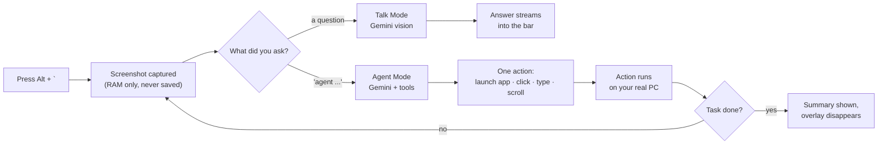

<div align="center">


[](https://git.io/typing-svg)

**An open-source, screen-aware AI assistant for Windows.**
Self-hosted. Privacy-first. Zero telemetry. Your API key, your data.

[](LICENSE)


[](https://github.com/nikeshsundar/argus/stargazers)

</div>

---

> **Status: Actively developed.** Talk Mode and Agent Mode are fully functional. See the [roadmap](#roadmap) for upcoming features.

### Contents

[Demo](#demo) · [Features](#features) · [How it works](#how-it-works) · [Why Argus?](#why-argus) · [Privacy](#privacy) · [Getting Started](#getting-started) · [Commands](#commands--keyboard-shortcuts) · [Chat History](#chat-history--persistence) · [The Hotkey](#how-the-hotkey-works) · [Roadmap](#roadmap) · [Development](#development) · [Safety](#safety--agent-mode) · [Contributing](#contributing)

## Demo

> [!TIP]
> **A GIF belongs right here.** Record <kbd>Alt</kbd>+<kbd>`</kbd> → ask a question → get an answer, and separately an Agent Mode task, with [ScreenToGif](https://www.screentogif.com/) or [ShareX](https://getsharex.com/) — both free, both built for exactly this. Save it as `docs/demo.gif` and drop this in above:
>
> ```markdown
> 
> ```

## Features

### 🎯 Talk Mode
Ask questions about what's on your screen with full conversation history.
- Follow-up context preserved across messages
- See Gemini analyze your screen in real-time
- Chat history is persistent and resumable

### 🤖 Agent Mode  
Tell an AI to take control and complete tasks autonomously.
- Click, type, navigate—hands off
- Screen-aware decision making
- Safety limits: 14 actions max, instant <kbd>Esc</kbd> kill switch, amber frame overlay

**Examples:**
- *"agent, open notepad and write a grocery list"*
- *"agent, open chrome and navigate to github.com"*
- *"agent, find the price of the cheapest flight tomorrow"*

### 🔒 Privacy Built-In
- Screenshots stay in RAM only—never written to disk or logged
- Disabled when the hotkey isn't pressed
- Your own API key—no Argus servers, no data collection
- BYOK (Bring Your Own Key) model

## What it does

Hit <kbd>Alt</kbd>+<kbd>`</kbd> from anywhere in Windows. Argus grabs your screen and opens a small bar, and you either ask it something or hand it the wheel.

**Talk Mode** — ask about what you're looking at, then keep asking.

> *"who is this creator?"* → *"how many subscribers?"* → *"what's their most popular video?"*

Follow-ups understand what came before, so you don't have to re-explain yourself.

**Agent Mode** — start your request with `agent` and it operates the computer itself.

> *"agent, open notepad and type hello"* · *"agent, open chrome and go to github"*

It looks at the screen, decides the next click or keystroke, does it, looks again, and repeats until the task is done.

## How it works



Every Agent Mode step re-captures the screen before deciding the next move — it never fires off a blind sequence of actions.

## Why Argus?

**Open source & self-hosted.** Proprietary screen-aware assistants exist, but they're closed-source, Mac-only, or cost $20–100/month. Argus is free, for Windows, and you have the source.

**Privacy first.** Your screen contents are deeply personal data. The software that reads them should be something you can inspect, audit, and self-host. No cloud. No logging. No telemetry.

**Bring your own model.** Use Gemini or add your own provider. Your API key stays on your machine—no Argus intermediaries.

## Privacy

- Screenshots are **held in memory only** — never written to disk, never logged, and dropped when you dismiss the bar. Saved chats keep their text, never the image.
- The screen is captured **only when you press the hotkey**. Nothing runs in the background watching you.
- You bring your own API key. There is no Argus server; your screen goes to the model provider *you* choose, and nowhere else.

## Requirements

- Windows 10/11
- A free [Google Gemini API key](https://ai.google.dev)

## Getting Started

### Prerequisites
- Windows 10 or 11
- An API key from Google Gemini
  - [Get a Gemini API key](https://ai.google.dev)

### Quick Start

```bash
git clone https://github.com/nikeshsundar/argus.git
cd argus
npm install
npm run dev
```

The app lives in your system tray. Press <kbd>Alt</kbd>+<kbd>`</kbd> to open the bar.

**First time setup:**
1. Paste your Gemini API key into the bar: `/key YOUR_API_KEY`
2. Argus activates and selects the matching model
3. Start asking

**Note:** `npm run dev` also prints a local Vite URL. Ignore it—it won't work in a browser since Argus needs desktop APIs.

### Build a Windows Installer

```bash
npm run package   # outputs release/Argus-<version>-Setup.exe
```

## Commands & Keyboard Shortcuts

### Opening the Bar
| Shortcut | Action |
| --- | --- |
| <kbd>Alt</kbd>+<kbd>`</kbd> | Open / close the bar (default, rebindable) |

### In the Bar
| Key | Action |
| --- | --- |
| <kbd>↑</kbd> / <kbd>↓</kbd> | Navigate options |
| <kbd>Enter</kbd> | Send query or run highlighted option |
| <kbd>Esc</kbd> | Clear input |
| <kbd>Esc</kbd> <kbd>Esc</kbd> | Close bar |

### Commands
Type these into the bar to configure or control Argus:

| Command | Description |
| --- | --- |
| `/key <api-key>` | Save and activate your Gemini API key |
| `/model <model-id>` | Change the AI model |
| `/hotkey <combo>` | Rebind the activation hotkey (e.g., `Control+Alt+Space`) |
| `/history` | Browse and resume past conversations |
| `/new` | Start a fresh chat |
| `/forget` | Delete all saved chats permanently |
| `/help` | List all commands |

## Chat History & Persistence

Every conversation is saved automatically, so you can resume later without losing context.

- Pick up conversations with `/history` or the "Past chats" option
- Chat text is preserved; screenshots are not (only held in RAM)
- Switching to a new screen mid-conversation? No problem—the AI sees your current screen while remembering what you discussed
- All chats stored locally in `%APPDATA%\argus\history.json`
- Use `/forget` to delete all history at once

This design lets you build on conversations across sessions while maintaining privacy.

## How the Hotkey Works

By default, Argus binds <kbd>Alt</kbd>+<kbd>`</kbd>. 

Why not <kbd>Win</kbd>+<kbd>key</kbd>? Windows restricts Win-combinations at the OS level and doesn't hand them to apps. Argus uses a low-level keyboard hook (same as PowerToys) to capture keys when Electron can't claim them natively.

A hook can *see* a keystroke but cannot *block* it from reaching other apps. That's why <kbd>Win</kbd>+<kbd>`</kbd> isn't the default: it would open Windows Terminal's quake mode every time. <kbd>Alt</kbd>+<kbd>`</kbd> is free on stock Windows.

**Conflicting hotkey?** Rebind with `/hotkey Control+Alt+Space` or any combo you prefer.

## Roadmap

### ✅ Completed
- [x] Global hotkey (including Win combinations), system tray, request bar
- [x] In-memory screen capture with zero-disk storage
- [x] Talk Mode with follow-up context (Gemini)
- [x] Command palette in the bar
- [x] Persistent chat history (resumable conversations)
- [x] Agent Mode with autonomous mouse & keyboard (Gemini)

### 🚧 In Progress & Planned
- [ ] Support for additional providers
- [ ] On-screen annotations (arrows, highlights, boxes)
- [ ] OpenAI and local Ollama provider support
- [ ] Settings UI (currently all in-bar commands)
- [ ] Encrypt stored API keys with Electron `safeStorage`
- [ ] Voice input / dictation support
- [ ] Prebuilt installers in GitHub Releases
- [ ] Multi-monitor support optimization

Contributions welcome! See [Contributing](#contributing) for details.

## Development

### Setup
```bash
npm run dev        # run with hot reload
npm run typecheck  # type-check main, preload, and renderer
npm test           # run unit tests
npm run build      # bundle to out/
npm run icon       # regenerate resources/icon.png
```

### Project Structure
```
src/main/       Electron main process — hotkey, screen capture, agent loop, 
                windows management, system tray
src/preload/    Context-isolated bridge exposed to the renderer
src/renderer/   UI: request bar and agent overlay  
src/shared/     Shared types and logic used across all processes
tests/          Unit tests for core logic and integration
```

### Key Technologies
- **Electron** — Cross-platform desktop framework
- **Vite** — Lightning-fast build tooling  
- **TypeScript** — Type-safe codebase
- **Google Gemini** — AI model powering Talk & Agent modes

## Safety & Agent Mode

Agent Mode gives an AI real control of your mouse and keyboard. Here's how we keep that safe:

| Safety Layer | How It Works |
| --- | --- |
| **Visual Indicator** | Pulsing amber frame covers the screen during agent execution — it never operates silently |
| **Instant Kill** | Press <kbd>Esc</kbd> from anywhere to stop immediately, even if Argus isn't focused |
| **Action Cap** | Maximum 14 actions per task—prevents infinite loops or runaway behavior |
| **Single-Step Execution** | One action at a time with screen re-capture between steps; no blind sequences |

**Warning:** Agent Mode controls your real mouse and keyboard. Only direct it at tasks you can afford to have clicked/typed. Always supervise autonomous mode on unfamiliar websites or critical applications.

## Contributing

Contributions are welcome! Areas that could use help:

- **New providers:** Extend `src/main/providers/` to support OpenAI, Ollama, or other models
- **Annotation UI:** Implement on-screen arrows, highlights, and bounding boxes
- **Settings UI:** Build a dedicated settings window instead of bar-only commands
- **Agent improvements:** Better task decomposition, improved reliability, multi-window support
- **Tests:** Expand test coverage for agent logic and edge cases
- **Documentation:** Improve getting started guides, API docs, architecture docs

### Getting Started with Development
1. Fork the repo and clone locally
2. Run `npm install && npm run dev`
3. Make your changes
4. Run `npm test` to verify tests pass
5. Submit a PR with a clear description of your changes

All PRs should maintain TypeScript strict mode and pass the existing test suite.

## License

[MIT](LICENSE) — Feel free to use, modify, and distribute. See [LICENSE](LICENSE) for details.

---

<div align="center">

**Made with ❤️ by [nikeshsundar](https://github.com/nikeshsundar)**

[⭐ Star this repo](https://github.com/nikeshsundar/argus/stargazers) if Argus is useful to you — it genuinely helps.


</div>
